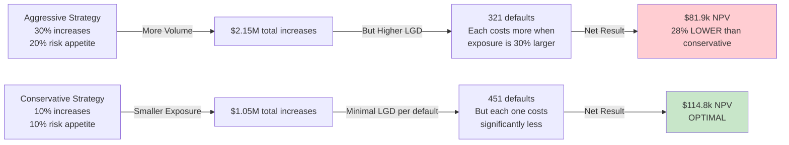
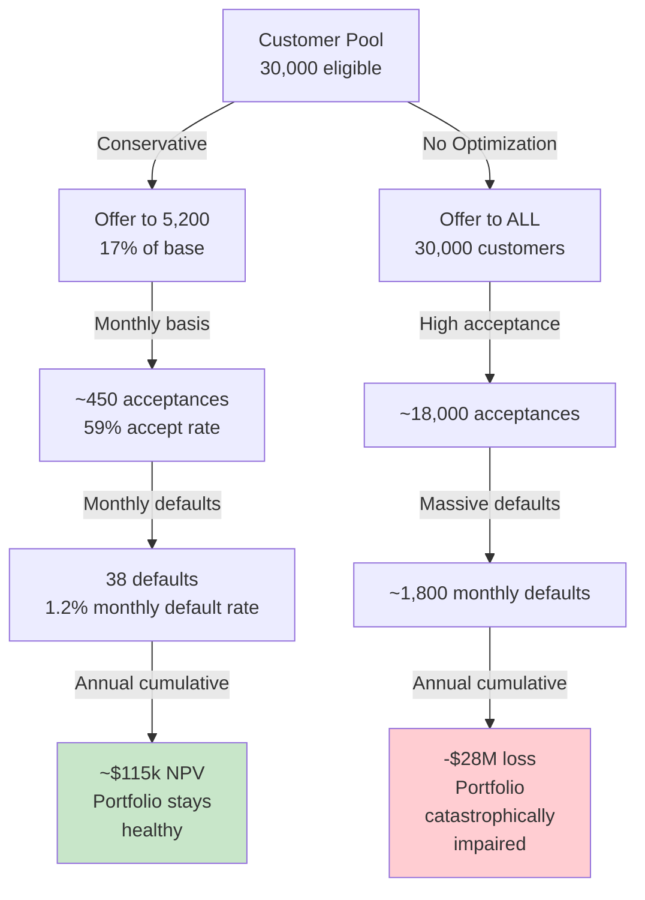
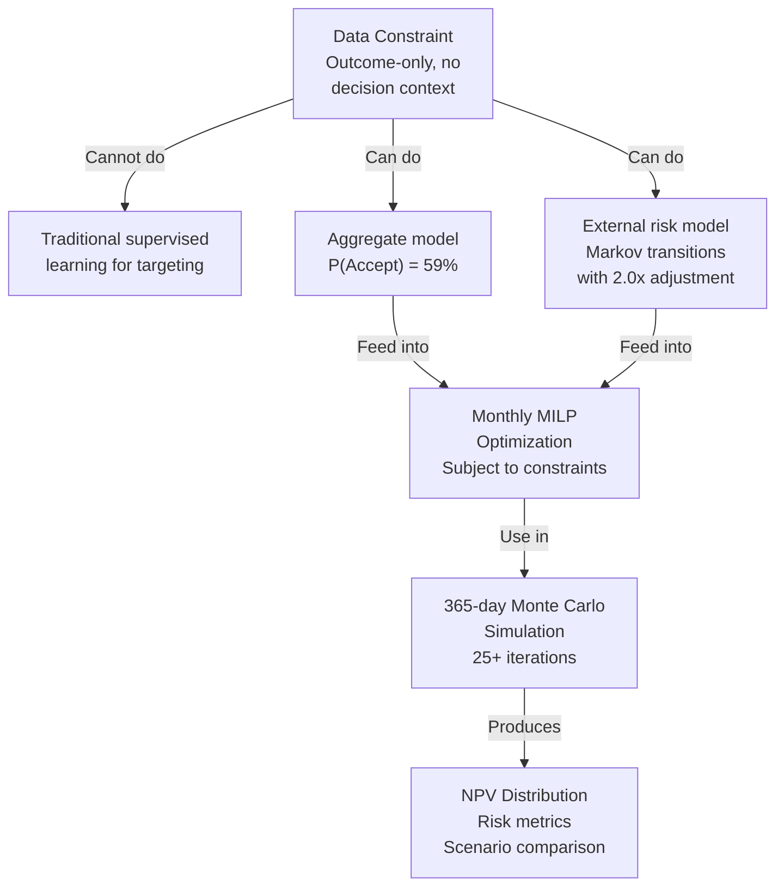
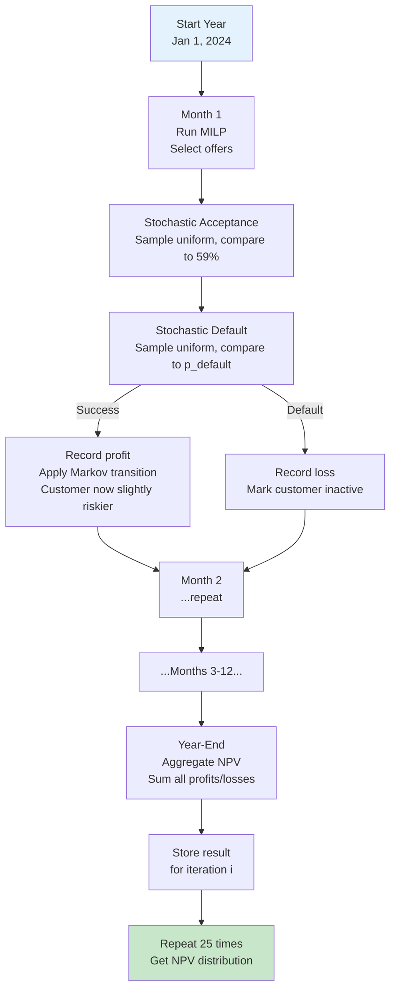

# Loan Limit Optimization: Strategic Presentation

---

## Part 1: The Key Finding

We faced a critical business decision: **How aggressively should we offer loan limit increases?**

The challenge: Limit increases drive customer retention and lifetime value, but aggressive scaling amplifies default risk. We needed a systematic, risk-aware framework.

**Our Finding**: A **conservative policy delivers optimal returns** despite lower volume. This counterintuitive result emerged from rigorous analysis and has significant implications for strategy.

---

## Part 2: The Recommendation

### Clear Recommendation

**Deploy a conservative limit increase policy:**
- **Increase Size**: 10% (vs. 20% baseline or 30% aggressive)
- **Risk Appetite**: 10% portfolio default rate cap (vs. 15% baseline)
- **Expected Annual NPV**: **$114,757**
- **Default Volume**: 451 customers
- **Total Offers**: ~5,200 customers (8.7% default rate on offers)

**Alternative Options**:
- Baseline policy: $95,607 NPV (20% lower)
- Aggressive policy: $81,924 NPV (28% lower)
- No policy (offer to all): -$27.97M loss (catastrophic)

### The Business Case

```
                        Conservative vs Baseline

                   NPV Improvement: $19,150 (20%)

                   With SAME capital budget ($1.24M/month)
                   and SAME risk constraints (15% appetite)

                   Smaller, more selective offers
                   outperform volume-based strategy
```

**Bottom Line**: By being more selective, we turn near-break-even customers into profitable ones. The model can't rank customers well enough to make large offers worthwhile.

---

## Part 3: Strategic Tradeoffs & Business Logic

### The Core Tradeoff: Size vs. Selectivity



### Why Conservative Wins: The Profit Equation & Structural Economics

For a typical customer (Near-Prime tier, 10% default risk, 59% acceptance rate):

**Conservative (10% increase):**
```
Expected Profit = 0.59 × [(0.90 × $40) - (0.10 × $250)]
                = 0.59 × [$36 - $25]
                = 0.59 × $11
                = +$6.49 ✓ Profitable
```

**Aggressive (30% increase):**
```
Expected Profit = 0.59 × [(0.90 × $40) - (0.10 × $750)]
                = 0.59 × [$36 - $75]
                = 0.59 × [-$39]
                = -$23.01 ✗ Loss-making
```

**The Structural Reality**: Most increases are inherently unprofitable. Here's why:
- Single increase profit: $40
- Loss per default at 10% default rate: Expected loss = 0.10 × $250-$750 (LGD ranges $250-$750 depending on increase size)
- For a 10% increase: Expected loss is $25, vs. profit of $40 → 63% margin
- For a 30% increase: Expected loss is $75, vs. profit of $40 → we're underwater

**Business Insight**: With weak ability to distinguish high-propensity customers, the profit equation is structurally constrained. Selectivity is the only lever available when targeting precision is limited.

### Levers to Improve Profitability (Structural & Tactical)

To unlock more aggressive policies, we can pull these levers:

**1. Increase the Profit Per Offer** (Structural)
- Current: $40 profit per accepted increase
- If we could negotiate higher interest or fees, profitability improves
- At $60 profit: Even 30% increases become marginally profitable
- Action: Finance team renegotiates pricing with customers or adjusts fee structure

**2. Lower the Loss Given Default** (Structural)
- Current: 10% recovery rate → 90% loss rate
- Better collections operations, collateral, or portfolio insurance could increase recovery to 20%
- At 20% recovery: Default costs drop from $75 to $60 on 30% increase
- Action: Collections team improves recovery processes; explore credit insurance

**3. Improve Demand Targeting** (Model-Driven)
- Current: Cannot differentiate customers (C-index 0.506)
- With longitudinal data (real offer/acceptance sequences), we could improve demand model to C-index 0.60+
- Better targeting means we can make larger offers to truly high-propensity customers, smaller ones to marginal customers
- Action: Collect 6 months of offer/response data; rebuild demand model with better features

**4. Dynamically Size Offers** (Tactical)
- Current: Fixed 10%, 20%, or 30% increase for all customers
- Better: Offer 10% to Near-Prime/Subprime, 30% to Prime customers (lower default risk)
- This fine-grained approach maximizes profit per risk tier without exposing high-risk segments to large losses
- Action: Implement risk-aware offer sizing instead of uniform increases

**5. Improve Risk Model Accuracy** (Model-Driven)
- Current: Default probabilities from external benchmarks + 2.0x adjustment
- With 2024 actuals: Build empirical transition matrix showing true customer migration
- More accurate risk assessment allows tighter capital allocation, fewer false rejections
- Action: Collect 12 months of customer behavior; recalibrate risk model

**Strategic Path**: Levers #1-2 (profit + recovery) are immediately available; levers #3-5 require 6-12 months of longitudinal data. Conservative policy today, while simultaneously investing in data collection, positions us to unlock baseline/aggressive policies by Q2 2025.

### Portfolio-Level Impact



---

## Part 4: Business Assumptions & Considerations

### Critical Assumptions

We built this system on several key assumptions. Each affects the recommendation:

#### 1. **Demand Stability** (Highest Impact)
**Assumption**: Customer acceptance patterns (59% baseline) remain stable into 2024.

**Business Context**: We're using historical offer acceptance as a proxy for future demand. If macro conditions shift (recession, competitor entry, regulatory change), demand could decline.

**How We Manage It**:
- Weekly monitoring: Track realized acceptance vs. forecast (59% expected)
- Alert threshold: >10pp deviation triggers investigation
- Action: If acceptance drops >15%, we pause and recalibrate

**Why It Matters**: 59% acceptance is baked into the NPV calculation. If it drops to 40%, expected profits fall by 32%.

#### 2. **Risk Multiplier** (Highest Impact)
**Assumption**: Default probabilities from external benchmarks (FICO) apply to our customer base with 2.0x emerging market adjustment.

**Business Context**: We don't have 2023 default data, so we use industry benchmarks (Prime 4%, Subprime 30%, High-Risk 50%) and scale up by 2x for Kenya market conditions.

**How We Manage It**:
- Q1 2024: Collect actual default experience
- Recalibrate multiplier based on realized rates
- If actual defaults > 2x forecast → tighten risk appetite
- If actual defaults < 1.5x forecast → loosen risk appetite

**Why It Matters**: If 2.0x is too aggressive and real defaults are 3.0x, we're under-reserving for risk.

#### 3. **Profit Per Increase** (Medium Impact)
**Assumption**: Each accepted limit increase generates $40 profit, regardless of size or customer tier.

**Business Context**: This is deterministic (fixed profit policy), but accounting treatment matters. If early defaults trigger clawback provisions, profit recognition changes.

**How We Manage It**: Finance team audits quarterly; adjust if policies change.

#### 4. **Capital & Risk Constraints** (Medium Impact)
**Assumptions**:
- Daily capital budget: $41.25k (derived from total portfolio)
- Risk appetite: 15% portfolio default rate (regulatory requirement)

**Business Context**: These are strategy-level parameters set by risk/portfolio teams, not derived from data.

**How We Manage It**: Scenario analysis shows NPV sensitivity to each constraint. If capital becomes more constrained (e.g., credit losses reduce available capital), we re-optimize.

### Key Risks to Monitor

| Risk | Indicator | Threshold | Action |
|------|-----------|-----------|--------|
| Demand drops | Realized acceptance rate | <46% or >66% | Pause & investigate |
| Risk model fails | Realized default rate | >2% monthly (vs 1.5% forecast) | Tighten risk appetite by 20% |
| Portfolio concentration | Any risk tier >40% of offers | >40% | Rebalance tier allocation |
| Capital constraint bind | Monthly utilization | >90% two months running | Escalate to portfolio team |
| Model drift | Weekly backtesting error | >5pp deviation | Retrain demand model |

---

## Part 5: The Value of Optimization

Before diving into methods, let's quantify the business impact:

### No-Optimization Baseline
If we offered to all 30,000 eligible customers monthly:
- Total volume (new limit increases disbursed): $48.5M annually
- Default rate: 72% (catastrophic)
- Expected NPV: **-$27.97M**

This isn't hypothetical—many lenders operate this way, scaling without selectivity.

### With Optimization (Conservative Policy)
- Total volume (new limit increases disbursed): $1.05M annually
- Default rate: 8.7% (managed)
- Expected NPV: **+$114.8k**

### Value-Add
$$\text{Value-Add} = +\$114.8k - (-\$27.97M) = \$28.1M \text{ annually}$$

**Translation for business**: Building a decision framework that respects risk constraints saves $28M per year in avoided losses. This is why systematic optimization matters—the downside of naive approaches is massive.

---

## Part 6: How We Built This (Methodology Overview)

### The Challenge: What Makes This Hard?

Before we discuss methods, understand the constraint: **We can't just train a classifier.**

To build a traditional ML model predicting "will this customer accept?", we'd need:
- Historical data showing which customers were *offered* and their responses
- This dataset shows only accepted increases; no rejection data

**What we have instead**: A snapshot of customers and their 2023 outcome (0, 3, 4, or 5 increases). This is outcome-only data, not decision-context data.

This rules out:
- ❌ Supervised learning for individual targeting
- ❌ Reinforcement learning (no feedback loops from decisions)
- ❌ Causal inference (no randomization)

### Our Solution: Simulation-Based Optimization

Instead of predicting individuals, we:

1. **Model aggregate acceptance rate** (59%) using survival analysis (Cox PH)
2. **Model risk transitions** using external benchmarks (FICO Markov matrix, 2.0x Kenya adjustment)
3. **Optimize portfolio-level decisions** (MILP) subject to capital and risk constraints
4. **Simulate forward** (Monte Carlo) to evaluate strategies under uncertainty



### Practical Implications

This approach is **actually stronger** for this business problem:
- We don't need to differentiate individuals; we need to set portfolio policy
- We can encapsulate business constraints (capital, risk appetite) directly
- We get uncertainty quantification (VaR, CVaR) for risk governance
- Easily runs scenario analysis for strategic planning

---

## Part 7: Technical Deep Dive (For Those Interested)

### Component 1: Demand Model (Cox Proportional Hazards)

**What it does**: Estimates probability a customer accepts a limit increase offer.

**Why Cox PH today?**: Treats "number of previous increases" as survival time. Handles right-censoring (customers capped at 5 increases). On the current data (snapshot only), it's the best we can do.

**Performance**: C-index 0.506 on held-out data
- Baseline random: 0.500
- Lift: 60 bps above random

**Interpretation**: The features available in our snapshot (loan amount, days since last offer, payment history) have near-zero correlation with acceptance. Despite weak signals, Cox produces well-calibrated predictions (58.85% vs 56% actual).

**Why this matters**: Weak demand signal is why conservative strategy wins. If we can't differentiate high-propensity from low-propensity customers, smaller offers reduce downside.

**Note on Model Evolution**: With longitudinal offer/response data (which we'll collect in Phase 1), simpler models like logistic regression or tree-based models (XGBoost, random forests) may outperform Cox PH. The current approach is appropriate for snapshot data but not optimal long-term.

### Component 2: Risk Model (Markov Transitions)

**What it does**: Tracks how customers move between risk tiers (Prime → Near-Prime → ... → Default) as they accept and repay.

**Why external benchmarks?**: The data is a single snapshot (Dec 31, 2023). To estimate transitions, we'd need to observe customers at time t and again at time t+1. That requires panel data.

**The matrix**:
```
              Prime  Near-Prime  Subprime  High-Risk  Default
Prime          0.85      0.10       0.01       0.00      0.04
Near-Prime     0.05      0.80       0.05       0.00      0.10
Subprime       0.00      0.05       0.60       0.05      0.30
High-Risk      0.00      0.00       0.05       0.45      0.50
Default        0.00      0.00       0.00       0.00      1.00
```

**Dynamic eligibility**: When a customer accepts and repays successfully, they transition (e.g., Near-Prime → Subprime with 5% probability). Their new default probability applies to next month's offer decision.

**Calibration**: Will estimate empirical transitions from 2024 actuals. If real defaults higher than 2.0x assumption, we recalibrate.

### Component 3: Optimization (MILP)

**What it does**: Selects which customers to offer, maximizing expected profit subject to constraints.

**The decision**: For each customer, offer or don't offer (binary variable).

**Objective**: Maximize ∑ (probability of acceptance) × (expected profit if accepted)

**Constraints**:
- Daily capital limit: $41.25k (derived from portfolio ÷ 365 days)
- Portfolio default rate: 15% max (risk appetite)

**Speed optimization**:
- Expected profit pre-filtering: Only optimize over positive-profit customers (90% reduction)
- Monthly batching: Solve once per month, not daily (30x fewer solves)
- Combined: 50x speedup (6 minutes per simulation vs 300 minutes)

### Component 4: Simulation (Monte Carlo)

**What it does**: Runs 365-day forward simulation with monthly MILP optimization, capturing stochastic outcomes.

**Process**:
1. Initialize customers (risk category, days since last offer, active status)
2. Each month: Run MILP → decide who to offer
3. For each offered customer:
   - Draw random uniform variate u ∈ [0,1]
   - If u < p_accept (59%), customer accepts; otherwise rejects
   - If accepted, draw another random variate v ∈ [0,1]
   - If v < p_default, customer defaults; otherwise repays successfully
   - If success: Apply Markov transition (update risk category)
   - If default: Mark inactive, record loss
4. Discount all cash flows at 19% annual rate
5. Aggregate annual NPV

**Technical Note**: We're not using Bernoulli distributions explicitly. Instead, we sample uniformly and compare to probability thresholds. This is mathematically equivalent but more efficient in implementation. For 5,000 customer offers:
- Draw 5,000 uniform variates [u₁, u₂, ..., u₅₀₀₀]
- Count how many satisfy u_i < 0.59 → these are the acceptances (~2,950)
- For those 2,950, draw another 2,950 uniform variates
- Count how many satisfy v_j < p_default_j → these are the defaults

**25+ iterations** capture distribution of outcomes, enabling VaR/CVaR risk metrics.



---

## Part 8: Production Roadmap

### Phase 1: Conservative Deployment & Data Collection (Months 1-3)

**Go-Live**: Conservative policy (10% increases, 10% risk appetite, 50% offer rate cap)

**Parallel Data Initiatives**:
We simultaneously begin collecting the right data to build better models:
- **Capture full decision context**: For each customer offer, record: offer date, offer size, customer response (accept/reject), timing of acceptance, repayment outcome, default event
- **Collect rich customer features**: Behavioral patterns (offer interaction, engagement frequency), temporal features (day of week effects, seasonal patterns), macroeconomic indicators (unemployment, inflation, interest rates at time of offer)
- **Track outcome sequences**: Build longitudinal view of each customer across multiple offer cycles

**Model Exploration**:
- Parallel track: Test simpler models (logistic regression, XGBoost) on the accumulating data
- Hypothesis: With decision context data, simpler models should outperform Cox PH
- Goal: By end of Phase 1, identify which model architecture works best

**Monitoring Dashboard**:
- Daily: Offer count, acceptance rate, capital utilization
- Weekly: Realized vs. forecast acceptance, defaults
- Monthly: Portfolio concentration, NPV projection

**Decision Gate**: If acceptance stays within 46%-66% (vs 59% forecast), escalate to Phase 2.

### Phase 2: Model Calibration & A/B Test (Months 4-6)

**Model Improvements**:
- Estimate empirical Markov transition matrix from 3 months of 2024 customer movements
- Recalibrate risk multiplier based on realized default rates
- Retrain demand model with decision-context data (NOT Cox PH necessarily—use whichever model performed best in Phase 1)
- Likely candidates: Logistic regression (simpler, interpretable), XGBoost (captures non-linearities), neural nets (flexible)

**A/B Test**:
- 70% cohort: Model-driven offers (using new models)
- 30% cohort: Random offers (control)
- Measure: Acceptance rate, default rate, NPV difference
- Decision gate: If A/B shows >5% lift in risk-adjusted return, proceed to Phase 3

**Transition Strategy**:
- If new models show >10% improvement over Cox PH, migrate to those models
- If Cox PH holds up well, continue with current approach but enhanced with better data
- Either way: Phase 2 resolves which path to take going forward

### Phase 3: Full Production (Months 7-12)

**Policy**: Baseline (20% increases, 15% risk appetite) or updated policy based on Phase 2 results

**Dynamic Management**:
- Daily monitoring dashboard
- Weekly backtesting and drift detection
- Monthly MILP runs with current models
- Quarterly model retraining with fresh data

**Escalation Path**: If Phase 2 A/B shows strong performance, gradually move toward more aggressive policies.

---

## Part 9: The Case for This Approach

### Why This System Matters

1. **Quantifies Tradeoffs**: Rather than debating "how aggressive should we be?", we show quantified NPV for each strategy. Data-driven, not gut-driven.

2. **Respects Constraints**: Automatically enforces capital and risk limits. No manual negotiation between lending and risk teams.

3. **Handles Uncertainty**: Monte Carlo captures distribution of outcomes. We know downside risk (VaR @ 95%).

4. **Extensible**: As demand signals improve (C-index 0.506 → 0.60+), more aggressive strategies become optimal. System improves over time.

5. **Operational**: Monthly batching aligns with business cycles. Easy to implement, monitor, and adjust.

### Commitment to Model Improvement

A key insight from this analysis: **The model is not the bottleneck—the data is.**

Conservative policy emerges not because we have a great demand model, but because we have a weak one. With the right longitudinal data and simpler model architectures, we can unlock better targeting and more aggressive strategies.

Phase 1 is therefore as much about data collection as deployment. We're investing in the foundation for Year 2 and beyond, where improved models will enable better capital allocation.

---

## Closing: Key Takeaways

1. **Finding**: Conservative policy is optimal ($114.8k NPV) despite lower volume—signal quality, not scale, matters

2. **Recommendation**: Deploy conservative policy immediately with weekly monitoring; escalate based on performance data

3. **Value**: $28.1M annual value-add vs. naive "offer to all" baseline

4. **Approach**: Simulation-based optimization respects business constraints and quantifies tradeoffs

5. **Roadmap**: Conservative → Calibrate with right data → Scale with improved models, with A/B testing validating value

6. **Model Evolution**: Cox PH is appropriate for snapshot data; Phase 1 data collection enables transition to simpler, more effective models in Phase 2

---

## Appendix: Mathematical Formulations

### A.1 Expected Profit Formula

For each customer i, the expected profit when offered a limit increase is:

$$E[\pi_i] = P(\text{Accept}_i) \times \left[ (1 - P(\text{Default}_i)) \times \pi_s - P(\text{Default}_i) \times \text{LGD}_i \right]$$

where:
- $P(\text{Accept}_i)$: Probability customer accepts the offer (from Cox PH model)
- $P(\text{Default}_i)$: Probability of default (from Markov transition matrix by risk category)
- $\pi_s = 40$: Profit in dollars earned on successful repayment
- $\text{LGD}_i$: Loss Given Default for customer i

### A.2 Loss Given Default (LGD)

$$\text{LGD}_i = \rho_{\text{loss}} \times \text{EAD}_i \times (1 - \rho_{\text{recovery}})$$

where:
- $\rho_{\text{loss}} = 0.5$: Loss realization percentage (default occurs at 50% of loan paydown)
- $\text{EAD}_i = L_i \times (1 + \alpha)$: Exposure at default (original loan + increase)
  - $L_i$: Initial loan amount for customer i
  - $\alpha$: Increase percentage (0.10, 0.20, or 0.30)
- $\rho_{\text{recovery}} = 0.10$: Recovery rate on defaulted loans

Simplified:
$$\text{LGD}_i = 0.5 \times L_i \times (1 + \alpha) \times (1 - 0.10) = 0.45 \times L_i \times (1 + \alpha)$$

### A.3 Mixed-Integer Linear Program (MILP)

**Decision Variables:**
$$x_i \in \{0, 1\} \quad \forall i \in \text{Eligible Cohort}$$

where $x_i = 1$ means offer a limit increase to customer i, and $x_i = 0$ means do not offer.

**Objective Function** (Maximize Expected Profit):
$$\max \sum_{i \in \text{Eligible}} x_i \cdot E[\pi_i]$$

where $E[\pi_i]$ is calculated per the formula in A.1.

**Constraint 1: Daily Capital Allocation**
$$\sum_{i \in \text{Eligible}} x_i \cdot \alpha \cdot L_i \leq K_{\text{daily}}$$

The total increase amount across all selected customers cannot exceed the daily capital budget $K_{\text{daily}}$ (e.g., $41,250).

**Constraint 2: Portfolio Risk Appetite**

The weighted average default probability of offered customers must not exceed risk appetite threshold $\theta$ (e.g., 0.15 for 15% appetite).

$$\sum_{i \in \text{Eligible}} x_i \cdot P(\text{Default}_i) \leq \theta \sum_{i \in \text{Eligible}} x_i$$

Equivalently, the weighted average is constrained by:

$$\text{Weighted Avg Default} = \frac{\sum_{i} x_i \cdot P(\text{Default}_i)}{\sum_{i} x_i} \leq \theta$$

### A.4 Net Present Value (NPV) Calculation

Daily profit or loss is discounted back to present value using a 19% annual discount rate, where $r = 0.19$ and $d \in [1, 365]$ denotes the day of the year:

$$NPV_d = \frac{\text{Outcome}}{(1 + r)^{d/365}}$$

**On successful repayment:**
$$NPV_{\text{success}} = \frac{40}{1.19^{d/365}}$$

**On default:**
$$NPV_{\text{default}} = \frac{-LGD_i}{1.19^{d/365}}$$

**Annual NPV aggregation:**
$$\text{Total NPV} = \sum_{d=1}^{365} \sum_{\text{all customers}} NPV_d$$

### A.5 Markov Chain Transition Probabilities

The transition matrix specifies the probability of moving from state s to state s':

$$P(\text{state}_{t+1} | \text{state}_t) = \begin{bmatrix}
P(P | P) & P(NP | P) & P(S | P) & P(HR | P) & P(D | P) \\
P(P | NP) & P(NP | NP) & P(S | NP) & P(HR | NP) & P(D | NP) \\
P(P | S) & P(NP | S) & P(S | S) & P(HR | S) & P(D | S) \\
P(P | HR) & P(NP | HR) & P(S | HR) & P(HR | HR) & P(D | HR) \\
0 & 0 & 0 & 0 & 1
\end{bmatrix}$$

where P=Prime, NP=Near-Prime, S=Subprime, HR=High-Risk, D=Default.

The default state is absorbing: $P(D | D) = 1.0$.

### A.6 Cox Proportional Hazards Partial Likelihood

The partial likelihood for Cox PH model is:

$$L(\beta) = \prod_{i: \delta_i=1} \frac{\exp(\beta^T x_i)}{\sum_{j \in R_i} \exp(\beta^T x_j)}$$

where:
- $\delta_i$ = event indicator (1 for acceptance, 0 for censoring)
- $x_i$ = covariate vector for customer i
- $R_i$ = risk set (customers eligible at time $t_i$)
- $\beta$ = coefficient vector

**Predicted acceptance probability:**
$$P(\text{Accept}_i) = 1 - \exp(-\hat{h}(t_i | x_i))$$

where $\hat{h}(t_i | x_i) = \hat{h}_0(t_i) \exp(\beta^T x_i)$ is the estimated hazard at time $t_i$.

### A.7 Portfolio Default Rate Constraint

Expected number of defaults across portfolio:

$$E[\text{Defaults}] = \sum_{i \in \text{Offered}} P(\text{Default}_i)$$

Portfolio default rate as a percentage:

$$\text{Default Rate} = \frac{E[\text{Defaults}]}{N_{\text{offers}}} \times 100\%$$

where $N_{\text{offers}}$ is the total number of customers offered a limit increase.

This is constrained to not exceed risk appetite $\theta$ via Constraint 2 in section A.3.
